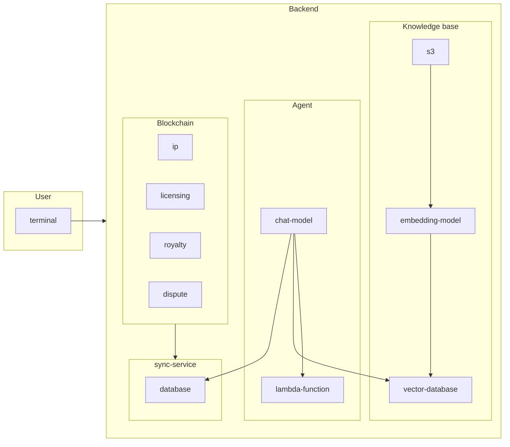

# Decentralized Programmable Intellectual Property (Depip)

Depip agent is an AI agent who can help you answer questions about Programable IP License from [Story Protocol](https://docs.storyprotocol.xyz/docs/what-is-story-protocol), help you create an IP license, register NFT as IP... with no coding. Just ask the agent.

## Overview architecture
This backend has 2 part: api and sync service. API is connected to AWS bedrock agent service, and sync currently sync IP asset from Story Protocol on Sepolia testnet.


## Currently status
This repository is under development. You can try swagger on the link https://dev.depip.studio/documentation
## Deployment
```
yarn install
cp .env.sample .env
yarn start:dev
```
