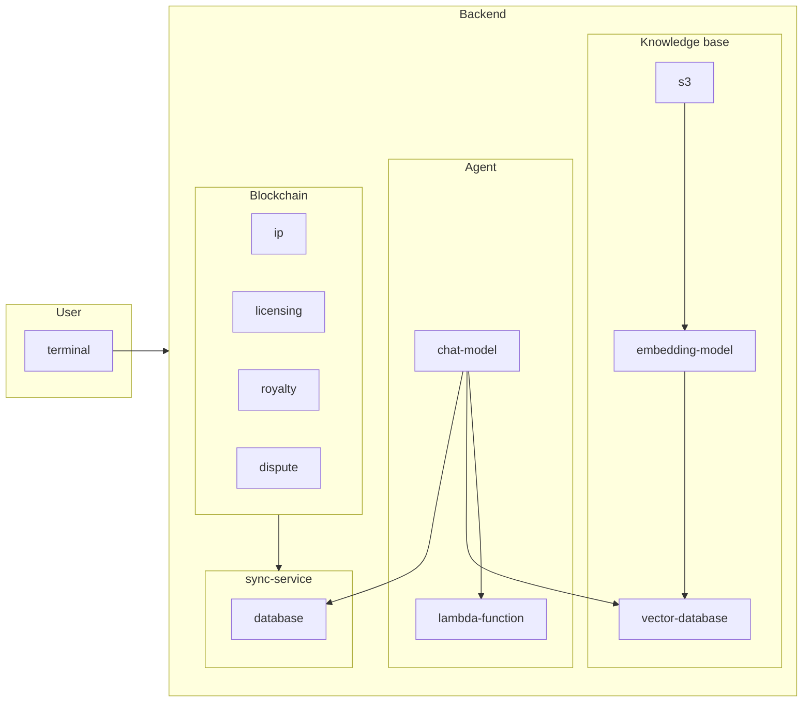

# Depip backend
Depip backend is backend of Depip project. Currently, it has some modules below:
- AI agent service
    - answer question about story protocol
    - help user interacting with story protocol:
        - create IP asset
        - create PIL term
        - attach PIL term to IP asset   
        - mint license token
- Sync service  
    - ip asset
    - license
    - dispute
    - derivative
- Particle smart account

## Overview architecture
This backend has 2 part: api and sync service. API is connected to AWS bedrock agent service, and sync currently sync IP asset from Story Protocol on Sepolia testnet.


```mermaid
flowchart LR

subgraph "Backend"
    subgraph "Agent"
        chat-model[chat-model]
        lambda-function[lambda-function]
        chat-model --> lambda-function
    end
    subgraph "Knowledge base"
        direction TB
        s3[s3]
        embedding-model[embedding-model]
        vector-database[vector-database]
        s3 --> embedding-model --> vector-database
    end  
    subgraph "sync-service"
        database[database]
    end
    
    subgraph "Blockchain"
        IP[ip]
        licensing[licensing]
        royalty[royalty]
        dispute[dispute]
    end
end

subgraph "User"
    terminal-frontend[terminal]
end

chat-model --> vector-database
chat-model --> database
Blockchain --> sync-service
terminal-frontend --> Backend

```
## Currently status
This repository is under development. You can try swagger on the link https://dev.depip.studio/documentation
## Deployment
```
yarn install
cp .env.sample .env
yarn start:dev
```
